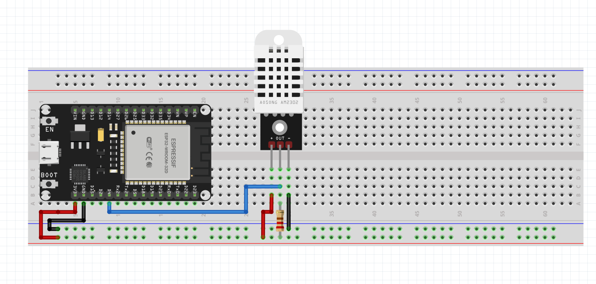

# 02 — Matériel & Câblage

[← Vue d'ensemble](01-vue-ensemble.md) | [Suivant : Code Arduino →](03-code-arduino.md)

---

## Composants

### ESP32

Microcontrôleur double cœur Xtensa LX6 avec WiFi 802.11 b/g/n et Bluetooth intégrés. C'est le cerveau du module IoT.

| Caractéristique | Valeur |
|---|---|
| CPU | Dual-core Xtensa LX6, 240 MHz |
| Flash | 4 Mo |
| RAM | 520 Ko SRAM |
| WiFi | 802.11 b/g/n 2.4 GHz |
| GPIO | 34 pins |
| Tension | 3.3V (alimentation USB 5V via régulateur) |
| Consommation | ~240 mA (WiFi actif) / ~10 µA (deep sleep) |

### DHT22 (AM2302)

Capteur numérique de température et d'humidité relative. Protocole propriétaire 1-Wire sur un seul fil de données.

| Caractéristique | Valeur |
|---|---|
| Plage température | −40°C à +80°C |
| Précision température | ± 0.5°C |
| Plage humidité | 0% à 100% HR |
| Précision humidité | ± 2–5% HR |
| Tension | 3.3V à 5.5V |
| Fréquence d'échantillonnage | Max 0.5 Hz (1 lecture toutes les 2s) |
| Protocole | 1-Wire propriétaire |

## Câblage



```
ESP32              DHT22
                 ┌─────────┐
3.3V  ──────────│ VCC  (1) │
GPIO4 ──────────│ DATA (2) │
                │ NC   (3) │
GND   ──────────│ GND  (4) │
                └─────────┘
```

| Pin ESP32 | Pin DHT22 | Description |
|---|---|---|
| 3.3V | VCC (1) | Alimentation |
| GPIO4 | DATA (2) | Signal de données |
| — | NC (3) | Non connecté |
| GND | GND (4) | Masse |

### Résistance de pull-up

Une résistance de **4.7 kΩ à 10 kΩ** entre VCC et DATA est recommandée pour stabiliser le signal. Sur certains modules DHT22 avec breakout board, cette résistance est déjà intégrée.

```
3.3V ──┬── 4.7kΩ ──┬── GPIO4
       │           │
      VCC         DATA
```

## Configuration du pin dans le code

Le pin de données est défini dans `config.h` :

```cpp
#define DHTPIN  4      // GPIO4
#define DHTTYPE DHT22
```

Pour utiliser un autre GPIO, modifier uniquement `DHTPIN`. Les GPIO disponibles sur l'ESP32 pour entrée/sortie : 0, 2, 4, 5, 12-19, 21-23, 25-27, 32-33.

## Alimentation

| Option | Connexion | Avantage |
|---|---|---|
| USB | Port micro-USB de l'ESP32 | Simple, alimentation fixe |
| Batterie Li-Po 3.7V | Pins BAT+ / BAT− (si module avec gestion batterie) | Portable |
| Alimentation 5V externe | Pin VIN de l'ESP32 | Installation fixe |

Pour une installation en production (entrepôt), une alimentation USB via adaptateur secteur est recommandée pour la fiabilité.

---

[← Vue d'ensemble](01-vue-ensemble.md) | [Suivant : Code Arduino →](03-code-arduino.md)
